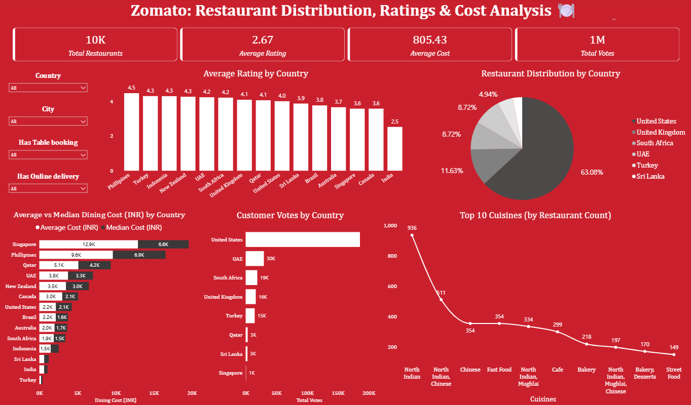

# 🍴 Zomato Power BI Dashboard

Power BI dashboard analyzing restaurant distribution, ratings, dining cost, and customer votes using the Zomato dataset.

## 📊 Dashboard Preview

## 🔑 What’s inside
- Filters: Country, City, Has Table Booking, Has Online Delivery
- Visuals: Ratings by country, Restaurant distribution, Avg vs Median dining cost, Customer votes, Top cuisines
- KPIs: Total Restaurants, Average Rating, Average Cost, Total Votes

## 🚀 How to open
1. Download/clone this repo.
2. Open **“Zomato Sales Dashboard (1).pbix”** in **Power BI Desktop**.
